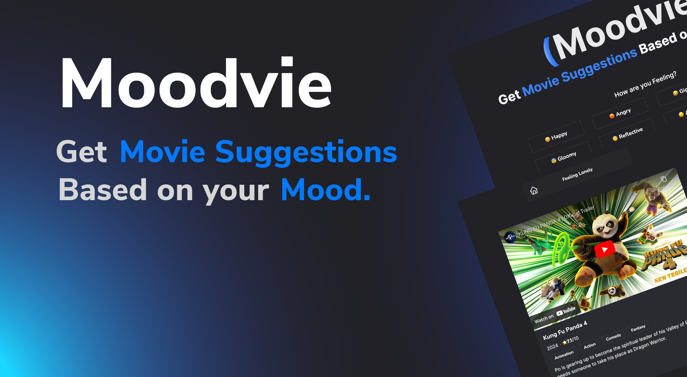

<h1 align="center">moodvie</h2>
<h3 align="center"> Get movie suggestions based on your mood!
</h3>

## Technologies Used

Built from scratch with:

[![Node][Node.js]][Node-url] [![React][React.js]][React-url] [![Tailwind-CSS][Tailwind]][Tailwind-url] 

This project utilizes the following APIs:

- **IMDb Movie API**: We use the IMDb Movie API to retrieve movie data such as titles, summaries, and ratings. For more information, visit the [IMDb API documentation][IMDb-url].

- **YouTube API**: We use the YouTube API to access video content and metadata for video playback and information. For more information, visit the [YouTube API documentation][Youtube-url].

Please ensure that your use of these APIs complies with their respective terms of service and licensing agreements.

[Node.js]: https://img.shields.io/badge/node.js-6DA55F?style=for-the-badge&logo=node.js&logoColor=white
[Node-url]: https://nextjs.org/](https://nodejs.org/en)
[React.js]: https://img.shields.io/badge/React-20232A?style=for-the-badge&logo=react&logoColor=61DAFB
[React-url]: https://reactjs.org/
[Bootstrap.com]: https://img.shields.io/badge/Bootstrap-563D7C?style=for-the-badge&logo=bootstrap&logoColor=white
[Bootstrap-url]: https://getbootstrap.com
[Tailwind]: https://img.shields.io/badge/tailwindcss-dbdbdb?style=for-the-badge&logo=tailwindcss
[Tailwind-url]: https://tailwindcss.com/
[Python]: https://img.shields.io/badge/python-3670A0?style=for-the-badge&logo=python&logoColor=ffdd54
[Python-url]: https://www.python.org/
[Flask-Py]: https://img.shields.io/badge/flask-%23000.svg?style=for-the-badge&logo=flask&logoColor=white
[Flask-url]: https://flask.palletsprojects.com/en/3.0.x/
[Fire-base]: https://img.shields.io/badge/firebase-a08021?style=for-the-badge&logo=firebase&logoColor=ffcd34
[Firebase-url]: https://firebase.google.com/
[Youtube-url]: https://developers.google.com/youtube/v3
[IMDb-url]: https://developer.imdb.com/documentation

